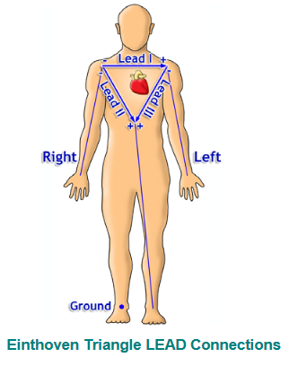
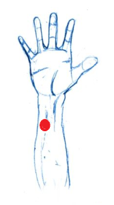
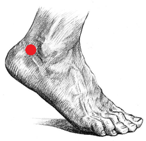
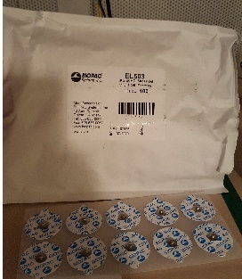

# Psychophysics - ECG {#psychophys-ecg}

Written by Gregory Steward on Jun 05, 2019

Ported to bookdown by Nathan Muncy on Jul 27, 2022.

## Introduction

An electrocardiogram (ECG) is a recording of the electrical activity of the heart using electrodes placed on the skin. These electrodes detect the small electrical changes that are a consequence of cardiac muscle depolarization followed by repolarization during each cardiac cycle (heartbeat)$^1$.

Our lab uses a 3 lead setup, where electrodes will be placed at 3 points on the body. Specifically, we follow a lead II configuration (see the diagram below).

```{r img-31, fig.align='center', out.width='50%', echo=F}

```

The lead II configuration consists of having the negative lead attached to the right wrist, the positive lead attached to the left ankle, and a grounded lead attached to the right ankle.

We prefer to use this configuration as the electrode placements interfere the least with other psychophysiology measure electrode placements. You can run using other configurations, but keep in mind the possible interference from other electrodes.

## Supplies

1. 3 x EL203 disposable electrodes
2. LEAD110
3. LEAD110S-R (the shielded red lead)
4. LEAD110S-W (the shielded white lead)
5. Paper towel
6. Nuprep
7. 3 x Q-Tips
8. Cotton wipe/ cotton round/ tissue
9. Gel 100

## Computer Preparation

1. Log into psychophysiology computer.
2. Turn on BIOPAC system.
3. Open Acknowledge (5.0 for MP160 system, 4.1 for MP150 system).
4. Load experimental file template.
    + Check that the input is Channel 4 (analog).
    + **Check where the data is being saved.**

## Lead Preparation

1. Take the red lead and attach it to the ECG cable in the testing room by attaching the red insert into the Vin$+$ slot and the black insert into the top shield slot.
2. Repeat with the white lead by attaching the white insert into the Vin$-$ slot and the black insert into the bottom shield slot.
3. Insert the black lead with the CBL205 attachment into the GND slot on the ECG cable.

```{r img-32, fig.show='hold', fig.align='center', out.width='40%', out.height='20%', echo=F}
knitr::include_graphics(c("imgs/03-ECG_mec.jpg","imgs/03-ECG_leads.jpg","imgs/03-ECG_ground_cable.jpg"))
```

## Electrode Preparation and Placement

1. Have the subject wash their hands/wrists with non-moisturizing and dye-free soap then dry with a paper towel (if there is no soap following the specifications, have the participant rinse with just water).
2. Prepare the q-tips with a drop of Nuprep each.
3. Instruct the participant to scrub an area of the lower right wrist/ upper right forearm (see below) with a prepped q-tip (make sure the location is slightly offset to the left of the arm mid-line).

```{r img-33, fig.align='center', out.width='20%', echo=F}

```

4. Repeat step 3 with the remaining q-tips for the areas behind the participant's ankles (see below, which is not directly on the ankle, but behind the ankle before the Achilles tendon slightly below the ankle mid-line).

```{r img-34, fig.align='center', out.width='20%', echo=F}

```

5. Have the participant clean off the Nuprep with a water wet cotton round or tissue.
6. Have participant dry applied areas with another cotton round or tissue.
7. While subject is drying, apply a "pea sized" drop of Gel 100 to the underside of one of the disposable electrodes.

```{r img-35, fig.align='center', out.width='40%', echo=F}
knitr::include_graphics("imgs/03-ECG_gel.jpg")
```

```{r img-36, fig.align='center', out.width='40%', echo=F}

```

8. Apply the gelled electrode to one of the three sites.
9. Repeat steps 7 and 8 for the two remaining sites.

## Lead Application and Clean Up

Unlike other psychophysiology measures in the lab, it is absolutely critical to attach and remove the leads to the participant in the correct order!

1. Take black ground lead and attach it to the subject's right ankle electrode.
2. Take the white lead and attach it to the subject's right arm electrode.
3. Take the red lead and attach it to the subject's left ankle electrode.
4. Run the experiment.
5. When finished, remove the leads in the inverse order you applied them (Red lead, white lead, black lead).
6. Have the subjects peel off the electrodes and dispose of them in the trash.
7. Offer the subject a wet paper towel or alcohol wipe to clean up any excess electrode gel that may be on them.
8. Hang all three leads back onto the ECG hook in the testing room.

## References

1. Electrocardiography. (2022, Jul 27). In *Wikipedia*. [https://en.wikipedia.org/wiki/Electrocardiography](https://en.wikipedia.org/wiki/Electrocardiography)