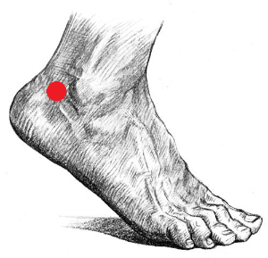

# Psychophysics {#psychophys}

##  Psychophysics - ECG {#psychophys-ecg}

Created on 2019 Jun 05 by Gregory Steward.

Ported to bookdown on 2022 Jul 27 by Nathan Muncy.

### Introduction

An electrocardiogram (ECG) is a recording of the electrical activity of the heart using electrodes placed on the skin. These electrodes detect the small electrical changes that are a consequence of cardiac muscle depolarization followed by repolarization during each cardiac cycle (heartbeat)$^1$.

Our lab uses a 3 lead setup, where electrodes will be placed at 3 points on the body. Specifically, we follow a lead II configuration (see the diagram below).

```{r img-3-ecg-1, fig.align='center', out.width='50%', echo=F}
knitr::include_graphics("imgs/03-ECG_eithoven.png")
```

The lead II configuration consists of having the negative lead attached to the right wrist, the positive lead attached to the left ankle, and a grounded lead attached to the right ankle.

We prefer to use this configuration as the electrode placements interfere the least with other psychophysiology measure electrode placements. You can run using other configurations, but keep in mind the possible interference from other electrodes.

### Supplies

1. 3 x EL203 disposable electrodes
2. LEAD110
3. LEAD110S-R (the shielded red lead)
4. LEAD110S-W (the shielded white lead)
5. Paper towel
6. Nuprep
7. 3 x Q-Tips
8. Cotton wipe/ cotton round/ tissue
9. Gel 100

### Computer Preparation

1. Log into psychophysiology computer.
2. Turn on BIOPAC system.
3. Open Acknowledge (5.0 for MP160 system, 4.1 for MP150 system).
4. Load experimental file template.
    + Check that the input is Channel 4 (analog).
    + **Check where the data is being saved.**

### Lead Preparation

1. Take the red lead and attach it to the ECG cable in the testing room by attaching the red insert into the Vin$+$ slot and the black insert into the top shield slot.
2. Repeat with the white lead by attaching the white insert into the Vin$-$ slot and the black insert into the bottom shield slot.
3. Insert the black lead with the CBL205 attachment into the GND slot on the ECG cable.

```{r img-3-ecg-2, fig.show='hold', fig.align='center', out.width='40%', out.height='20%', echo=F}
knitr::include_graphics(c("imgs/03-ECG_mec.jpg","imgs/03-ECG_leads.jpg","imgs/03-ECG_ground_cable.jpg"))
```

### Electrode Preparation and Placement

1. Have the subject wash their hands/wrists with non-moisturizing and dye-free soap then dry with a paper towel (if there is no soap following the specifications, have the participant rinse with just water).
2. Prepare the q-tips with a drop of Nuprep each.
3. Instruct the participant to scrub an area of the lower right wrist/ upper right forearm (see below) with a prepped q-tip (make sure the location is slightly offset to the left of the arm mid-line).

```{r img-3-ecg-3, fig.align='center', out.width='20%', echo=F}
knitr::include_graphics("imgs/03-ECG_electrode_wrist.png")
```

4. Repeat step 3 with the remaining q-tips for the areas behind the participant's ankles (see below, which is not directly on the ankle, but behind the ankle before the Achilles tendon slightly below the ankle mid-line).

```{r img-3-ecg-4, fig.align='center', out.width='20%', echo=F}

```

5. Have the participant clean off the Nuprep with a water wet cotton round or tissue.
6. Have participant dry applied areas with another cotton round or tissue.
7. While subject is drying, apply a "pea sized" drop of Gel 100 to the underside of one of the disposable electrodes.

```{r img-3-ecg-5, fig.align='center', out.width='40%', echo=F}
knitr::include_graphics("imgs/03-ECG_gel.jpg")
```

```{r img-3-ecg-6, fig.align='center', out.width='40%', echo=F}
knitr::include_graphics("imgs/03-ECG_electrodes.jpg")
```

8. Apply the gelled electrode to one of the three sites.
9. Repeat steps 7 and 8 for the two remaining sites.

### Lead Application and Clean Up

Unlike other psychophysiology measures in the lab, it is absolutely critical to attach and remove the leads to the participant in the correct order!

1. Take black ground lead and attach it to the subject's right ankle electrode.
2. Take the white lead and attach it to the subject's right arm electrode.
3. Take the red lead and attach it to the subject's left ankle electrode.
4. Run the experiment.
5. When finished, remove the leads in the inverse order you applied them (Red lead, white lead, black lead).
6. Have the subjects peel off the electrodes and dispose of them in the trash.
7. Offer the subject a wet paper towel or alcohol wipe to clean up any excess electrode gel that may be on them.
8. Hang all three leads back onto the ECG hook in the testing room.

### References

1. Electrocardiography. (2022, Jul 27). In *Wikipedia*. [https://en.wikipedia.org/wiki/Electrocardiography](https://en.wikipedia.org/wiki/Electrocardiography)


## Psychophysics - EDA {#psychophys-eda}

Created on 2019 Jun 05 by Gregory Steward.

Ported to bookdown on 2022 Jul 28 by Nathan Muncy.

### Introduction

Electrodermal activity (EDA) is the property of the human body that causes continuous variation in the electrical characteristics of the skin. Historically, EDA has been known as galvanic skin response or GSR (the MP150 has a module that is still labelled as GSR. It is believed that skin resistance varies with the state of sweat glands in the skin. Sweating is controlled by the sympathetic nervous system, and skin conductance is an indication of psychological or physiological arousal. If the sympathetic branch of the autonomic nervous system is highly aroused, then sweat gland activity also increases, which in turn increases skin conductance. In this way, skin conductance can be a measure of emotional and sympathetic responses$^1$.

Our lab in particular looks at EDA in the palm of the hand, as it allows for subjects to use their fingers to enter computer responses to stimuli, without affecting the data.


### Procedures

The following outlines the standard procedure for collecting skin conductance data in our lab.

**Note:** Place the electrodes a minimum of 5 minutes before recording, but aim for closer to 15 minutes.

1. Have the subject gently wash their hands with soap and water. Use the specific soap provided by the lab for this purpose, whether in the lab or the BIAC. Moisturizers and anti-bacterial components of soap products can affect conductivity in the skin; these can be difficult to avoid for our purposes, but we can be consistent about our use. More importantly, the soap should not be abrasive (micro-scrubbing beads and such) as this damage to the skin tissue can change its composition and conductivity. Dry hands gently but completely before electrode placement.
2. Use the disposable electrodes that come with gel already applied. Add a pea-sized drop of electrode gel on top of the gel in the electrode. We add fresh gel because the original gel dries over time and may not mix as well with the skin.
3. Place the electrode firmly on the hypothenar eminence of the non-dominant palm at a perpendicular orientation to the eminence leaving space for two adjacent electrodes along the length of the eminence. Apply the second electrode. Apply tape if necessary to keep electrodes in place (for example, if the subject has excessively sweaty hands). While the distal phalanges may be a slightly more ideal site for recording in terms of eccrine sweat gland distribution, the size of the hypothenar eminence allows for easier and more secure electrode placement and allows for more use of the fingers on the recording hand.
4. The subject may make responses with the fingers of the non-dominant hand as long as these responses do not occur during periods that will be analyzed for skin conductance. Further, the subject should be instructed to minimize any unnecessary movement of the recording hand since movement can introduce noise into the signal.

```{r img-3-eda-1, fig.align='center', out.width='40%', echo=F}
knitr::include_graphics("imgs/03-GSR_setup.jpg")
```

5. Connect the wires to electrodes so they are not obstructive or uncomfortable.
6. Begin acquisition with AcqKnowledge and check for proper signal. You can ask the subject to hold their breath briefly and then exhale to try to prompt a skin conductance response. If it seems likely the subject's conductance will hit ceiling levels at some point, the gain switch on the front of the GSR BIOPAC module may be repositioned from 10 microsiemens/volt to 20 before beginning the task and the data rescaled in AcqKnowledge accordingly. This should rarely be necessary, but be sure to note this in the subject's notes and replace the switch after the subject's session is complete.
    + **AcqKnowledge note:** We have been recording skin conductance at a frequency of 1 kHz in AcqKnowledge.

### References

1. Electrodermal activity. (2022, Jul 28). In *Wikipedia*. [https://en.wikipedia.org/wiki/Electrodermal_activity](https://en.wikipedia.org/wiki/Electrodermal_activity)


## Psychophysics - EGG {#psychophys-egg}

To be constructed (Jul 28, 2022).


## Psychophysics - EMG {#psychophys-emg}

Created on 2020 Feb 12 by Gregory Steward.

Ported to bookdown on 2022 Jul 28 by Nathan Muncy.

### Introduction

An electromyogram (EMG) is a psychophysiology measure for evaluating and recording the electrical activity produced by skeletal muscles. An electromyograph detects the electric potential generated by muscle cells when these cells are electrically or neurologically activated. The LaBar lab most frequently studies Corrugator Facial EMG and Zygomaticus Facial EMG , which focuses on the coruggator supercili group of muscles above the eye and the zygomaticus major muscle along the cheek, respectively$^1$.

### Supplies

1. 4 x EL254S reusable shielded electrodes
2. 1 x EL254 reusable un-shielded electrode
3. 5 x ADD204 Stickers
4. Biopac gel 100/ Signa Gel
5. Non moisturizing alcohol wipe
6. Nu-prep
7. Q-tips
8. Tissues
9. Cotton swab/ cotton round

### Computer Preparation

1. Log into psychophysiology computer.
2. Check that the BIOPAC EMG module is set to the following:
    + 5000 gain
    + 500 Hz low pass filter
    + 100 Hz high pass filter turned off
    + 10 Hz high pass filter
3. Turn on BIOPAC system.
4. Open Acknowledge (5.0 for MP160 system, 4.1 for MP150 system).
5. Load experimental file template.
    + Check that the sampling rate is 1000 kHz.
    + Check that the input is Channel 2 (for EMG1) or 3 (for EMG2).
    + Check where the data is being saved.

### Face Preparation

1. Clean face with an alcohol wipe.

```{r img-3-emg-1, fig.align='center', out.width='40%', echo=F}
knitr::include_graphics("imgs/03-EMG_supplies.jpg")
```

2. **OPTIONAL** - electrode face preparation can proceed just with the alcohol wipe) Apply the NuPrep (shown in the image above) with a Q-tip to the areas where the electrodes will be applied (see figure below for clarification on electrode placement sites). Apply mild pressure to scrub these areas with the Q-tip. Skin should be slightly red. This step helps to ensure that we are able to remove dead skin cells and have better conductance. If using NuPrep, make sure swabbed area is dry before applying electrodes.
3. Clean the NuPrep off with a cotton round or tissue.
4. Throw away all cotton pads, tissues, and Q-tips used during face prep.

### Electrode Preparation

1. Obtain 2 clean shielded EMG electrodes and 1 un-shielded EMG electrodes. The need for an un-shielded electrode is to establish a ground to help reduce noise. If you have a grounded lead already established with either ECG or EDA, you will not need to add this additional ground.

```{r img-3-emg-2, fig.show='hold', fig.align='center', out.width='40%', out.height='10%', echo=F}
knitr::include_graphics(c("imgs/03-EMG_shielded.jpg","imgs/03-EMG_electrodes.png"))
```

2. Place the circle stickers on the lead so that the hole of the lead align, and so the tab of the sticker is the same direction of the wire as shown in the image below.

```{r img-3-emg-3, fig.align='center', out.width='40%', echo=F}
knitr::include_graphics("imgs/03-EMG_adhesivediscs.png")
```

3. *(Optional for Corrugator)* Cut off the top edge and the left edge of the sticker that hang over the edge of the lead for the shielded leads.

```{r img-3-emg-4, fig.align='center', out.width='40%', echo=F}

```

4. Place signa gel into electrode well. Using a gel filled syringe, gently fill the well without touching the needle tip to the inside of the electrode. Make sure to fill it to the top of the well, but not too excessively. To get rid of any remaining air bubbles, use the packaging from the alcohol wipe or other rolled scrap of paper to stir the gel.

```{r img-3-emg-5, fig.show='hold', fig.align='center', out.width='30%', out.height='10%', echo=F}
knitr::include_graphics(c("imgs/03-EMG_electrode_filling.jpg","imgs/03-EMG_electrode_filled2.jpg"))
```

### Electrode Placement - corrugator muscle

1. Place first electrode so that it is in line with the inner corner of the subject’s right eye and just above the subject’s eyebrow. The electrode should be placed so that the wire sits perpendicular to the subject’s eyebrow.
2. Place the second electrode to the left of the first electrode (to the subject’s right). The electrode should be placed so that the wire sits parallel to the subject’s eyebrow.

```{r img-3-emg-6, fig.align='center', out.width='60%', echo=F}
knitr::include_graphics("imgs/03-EMG_placement_diagram.png")
```

3. If needed place the third un-shielded electrode in the middle of the forehead close to the hairline.
4. Place the lead wires behind the subject’s right ear and tape them to their right shoulder while the subject looks to their left. This will allow the subject to move or turn without tugging the wires.
5. For the shielded electrodes, plug the black wire (with the green shield marker) into the EMG plugs that say "shield". Plug the white signal wires into the the ports that say "VIN+" or "VIN-". Lastly, if you need a ground electrode, plug it into the center hole labelled "GND."

```{r img-3-emg-7, fig.align='center', out.width='60%', echo=F}
knitr::include_graphics("imgs/03-EMG_electrode_wiring.jpg")
```

### Electrode Placement - zygomaticus muscle

1. Have the subject smile to see if you can see the general area of the zygomaticus muscle.
2. Place first shielded electrode so that is directly on the muscle, which should be about halfway from the middle of the subject's ear to the corner of the subject's mouth.

```{r img-3-emg-8, fig.align='center', out.width='60%', echo=F}

```

3. Place the second shielded electrode adjacent to the first in the direction closer to the corner of the subject's mouth.
4. If needed place the third un-shielded electrode in the middle of the forehead close to the hairline and tuck the electrode lead wire behind the subject's ear.
5. Tape the electrodes to their right shoulder while the subject looks to their left. This will allow the subject to move or turn without tugging the wires.
6. For the shielded electrodes, plug the black wire (with the green shield marker) into the EMG plugs that say "shield". Plug the white signal wires into the the ports that say "VIN+" or "VIN-". Lastly, if you need a ground electrode, plug it into the center hole labelled "GND."

```{r img-3-emg-9, fig.align='center', out.width='60%', echo=F}
knitr::include_graphics("imgs/03-EMG_electrode_wiring2.jpg")
```

### Cleaning

1. When finished with the experiment, remove the stickers from the electrodes and dispose of them.
2. Use the distilled water squeeze bottle by the sink to clean the gel completely out of the leads.

```{r img-3-emg-10, fig.align='center', out.width='40%', echo=F}
knitr::include_graphics("imgs/03-EMG_electrode_clean.png")
```

3. If necessary, soak the electrode heads in a small cup of distilled water for 15 minutes and up to 1 hour and re-rinse with the squeeze bottle.
4. Hang the leads on the rack opposite of the sink to dry completely before using again.
5. Return all the gels, NuPrep, and stickers to their original locations.

```{r img-3-emg-11, fig.align='center', out.width='60%', echo=F}
knitr::include_graphics("imgs/03-EMG_electrode_rack.jpg")
```

### References

1. Electromyography. (2022, Jul 27). In *Wikipedia*. [https://en.wikipedia.org/wiki/Electromyography](https://en.wikipedia.org/wiki/Electromyography)


## Psychophysics - RSP {#psychophys-rsp}

Created on 2020 Sep 04 by Gregory Steward.

Ported to bookdown on 2022 Jul 29 by Nathan Muncy.

### Introduction

The Respiratory Effort Transducer measures changes in thoracic or abdominal circumference to assess respiratory effort.

### Supplies

Respiratory transducer belt. 

```{r img-3-rsp-1, fig.align='center', out.width='30%', echo=F}
knitr::include_graphics("imgs/03-RSP_belt.jpg")
```

1. Loosen one or both ends of the velcro on the transducer and wrap it around the chest of the subject (or have the subject wrap it around themselves if it is more comfortable).
2. Tighten the Respiratory Effort Transducer around the most expanded area of the subject’s abdomen during breathing (generally about 5 cm below the armpits), and tighten one or both straps until it fits snugly but is not uncomfortable.  The sensor should be placed on the front of the chest. 
3. Plug the transducer cable into the MEC100C extension cable labelled RSP. 

```{r img-3-rsp-2, fig.align='center', out.width='60%', echo=F}
knitr::include_graphics("imgs/03-RSP_plug.png")
```

If you have trouble getting a signal from the belt, try using one of the back up belts in the drawers of the testing room. 


## Psychophysics - STIM {#psychophys-stim}

Created on 2019 Sep 16 by Gregory Steward.

Ported to bookdown on 2022 Jul 29 by Nathan Muncy.

### Supplies

1. 2 x EL203 disposable electrodes
2. 2 x LEAD110
3. Paper Towel
4. Gel 100

### Computer Preparation

1. Log into psychophysiology computer.
2. Turn on BIOPAC system.
3. Turn on the stim box (**Note**: the stim box sends out a pulse on initializing, so make sure that the subject is not connected).
4. Make sure the stimulation level is set at 0.
5. Open Acknowledge (5.0 for MP160 system, 4.1 for MP150 system).
6. Load experimental file template.
    + Check that the input is Channel 4 (analog).
    + **Check where the data is being saved.**
7. (*Optional*) Open Presentation for the stim work-up, ignore if calibrating manually.

### Electrode Preparation and Placement
1. Have the subject wash their hands/wrists with non-moisturizing and dye-free soap then dry with a paper towel (if there is no soap following the specifications, have the participant rinse with just water).
2. While subject is drying, apply a "pea sized" drop of Gel 100 to the underside of one of the disposable electrodes.

```{r img-3-stim-1, fig.align='center', out.width='40%', echo=F}
knitr::include_graphics("imgs/03-ECG_gel.jpg")
```

```{r img-3-stim-2, fig.align='center', out.width='40%', echo=F}
knitr::include_graphics("imgs/03-ECG_electrodes.jpg")
```

3. Apply the gelled electrodes the left forearm in close proximity, but not overlapping. 

```{r img-3-stim-3, fig.align='center', out.width='30%', echo=F}
knitr::include_graphics("imgs/03-STIM_wrist.png")
```

4. Take the two leads attached to the stim cable and connect to the recently placed electrodes.

### Stim Calibration

Because the tolerance for electrical stimulation can vary wildly by individual subject, we calibrate the voltage level of stimulation each subject receives in a process called "stim work-up."

There are two means of doing the stim work-up; digital and analog. The primary difference is the duration of the stimulation, where you can set the digital to any time length (6 ms usually), whereas the analog is at a fixed 15ms.  

#### Digital calibration

1. Open the stim work-up file for the Presentation software (make sure the stim box voltage level is set to 0, or that the subject is disconnected from the electrode leads).
2. Set the voltage level to 10 volts on the stim box.
3. Tell the subject that we are going to tailor their level of stimulation to a point that they find annoying, but not painful and that you will start with a low level starter pulse.
4. Trigger the presentation software to send a pulse (it should be using port code 21).
5. Ask the subject how they feel.
6. Increase the voltage by 10 if the subject feels the level is weak.
7. Repeat steps 4-6 until the subject starts to feel something stronger.
8. Fine tune by increments of 2-5 volts until you find the level where the subject says the stimulation is annoying but not painful. 

#### Analog calibration

1. Set the voltage level to 10 volts on the stim box.
2. Tell the subject that we are going to tailor their level of stimulation to a point that they find annoying, but not painful and that you will start with a low level starter pulse.
3. Press the manual pulse button on the back of the stim box.
4. Ask the subject how they feel.
5. Increase the voltage by 10 if the subject feels the level is weak.
6. Repeat steps 4-6 until the subject starts to feel something stronger.
7. Fine tune by increments of 2-5 volts until you find the level where the subject says the stimulation is annoying but not painful.

### Clean Up

1. Set the stim box voltage to 0 volts.
2. Turn off the stim box (if the stim box is left on overnight it will likely blow a fuse).
3. Remove the leads from the subject and hang them back up on the stim hook.
4. Instruct the subject to remove the electrodes from their arm and dispose of them.
5. Offer the subjects a wet paper towel or show them the sink to clean excess gel left on their arm.

