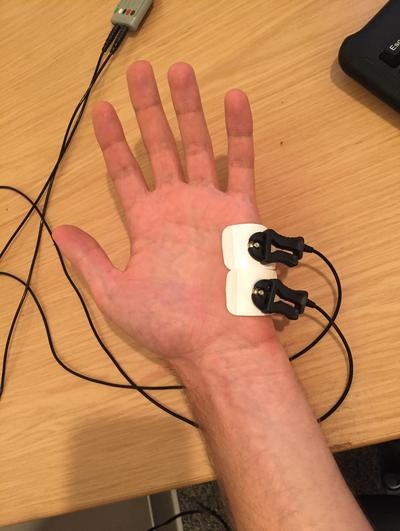

# Psychophysics - EDA {#psychophys-eda}

Written by Gregory Steward on Jun 05, 2019

Ported to bookdown by Nathan Muncy on Jul 28, 2022.

## Introduction

Electrodermal activity (EDA) is the property of the human body that causes continuous variation in the electrical characteristics of the skin. Historically, EDA has been known as galvanic skin response or GSR (the MP150 has a module that is still labelled as GSR. It is believed that skin resistance varies with the state of sweat glands in the skin. Sweating is controlled by the sympathetic nervous system, and skin conductance is an indication of psychological or physiological arousal. If the sympathetic branch of the autonomic nervous system is highly aroused, then sweat gland activity also increases, which in turn increases skin conductance. In this way, skin conductance can be a measure of emotional and sympathetic responses$^1$.

Our lab in particular looks at EDA in the palm of the hand, as it allows for subjects to use their fingers to enter computer responses to stimuli, without affecting the data.


## Procedures

The following outlines the standard procedure for collecting skin conductance data in our lab.

**Note:** Place the electrodes a minimum of 5 minutes before recording, but aim for closer to 15 minutes.

1. Have the subject gently wash their hands with soap and water. Use the specific soap provided by the lab for this purpose, whether in the lab or the BIAC. Moisturizers and anti-bacterial components of soap products can affect conductivity in the skin; these can be difficult to avoid for our purposes, but we can be consistent about our use. More importantly, the soap should not be abrasive (micro-scrubbing beads and such) as this damage to the skin tissue can change its composition and conductivity. Dry hands gently but completely before electrode placement.
2. Use the disposable electrodes that come with gel already applied. Add a pea-sized drop of electrode gel on top of the gel in the electrode. We add fresh gel because the original gel dries over time and may not mix as well with the skin.
3. Place the electrode firmly on the hypothenar eminence of the non-dominant palm at a perpendicular orientation to the eminence leaving space for two adjacent electrodes along the length of the eminence. Apply the second electrode. Apply tape if necessary to keep electrodes in place (for example, if the subject has excessively sweaty hands). While the distal phalanges may be a slightly more ideal site for recording in terms of eccrine sweat gland distribution, the size of the hypothenar eminence allows for easier and more secure electrode placement and allows for more use of the fingers on the recording hand.
4. The subject may make responses with the fingers of the non-dominant hand as long as these responses do not occur during periods that will be analyzed for skin conductance. Further, the subject should be instructed to minimize any unnecessary movement of the recording hand since movement can introduce noise into the signal.

```{r img-41, fig.align='center', out.width='40%', echo=F}

```

5. Connect the wires to electrodes so they are not obstructive or uncomfortable.
6. Begin acquisition with AcqKnowledge and check for proper signal. You can ask the subject to hold their breath briefly and then exhale to try to prompt a skin conductance response. If it seems likely the subject's conductance will hit ceiling levels at some point, the gain switch on the front of the GSR BIOPAC module may be repositioned from 10 microsiemens/volt to 20 before beginning the task and the data rescaled in AcqKnowledge accordingly. This should rarely be necessary, but be sure to note this in the subject's notes and replace the switch after the subject's session is complete.
    + **AcqKnowledge note:** We have been recording skin conductance at a frequency of 1 kHz in AcqKnowledge.

## References

1. Electrodermal activity. (2022, Jul 28). In *Wikipedia*. [https://en.wikipedia.org/wiki/Electrodermal_activity](https://en.wikipedia.org/wiki/Electrodermal_activity)