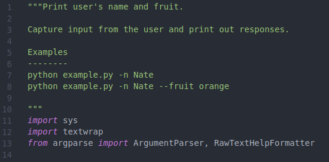
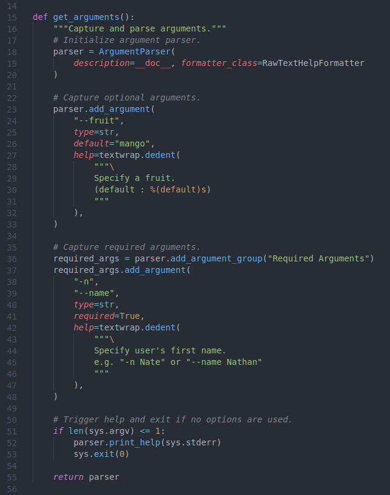
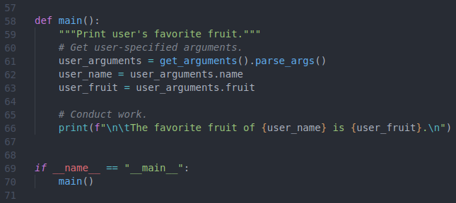
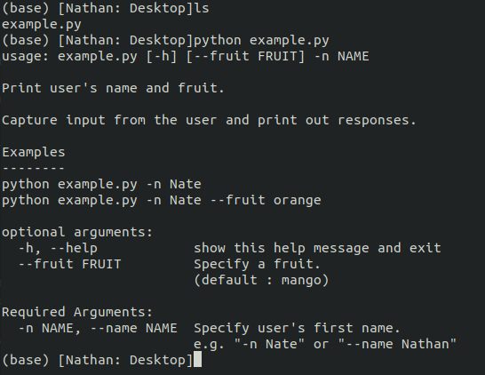
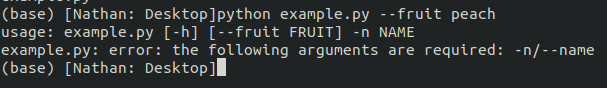
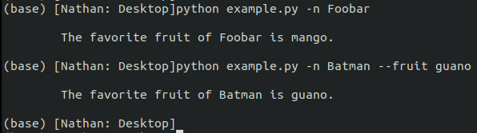

# Programming {#programming}

Written on 2022 Sep 04 by Nathan Muncy

This chapter is under construction.

## Introduction

The goal of this chapter is to provide general guidance on a number of topics with  an aim to standardize how code is written in the LaBar Lab. Standardization  will (1) speed-up the development and trouble-shooting process and (2) support maintenance and use efforts when students and researchers have left the lab.


## Best Practices

A programming adage says that "Code is written once but read many times". Best practices guide decisions that programmers make when writing their code, ranging from how to name variables to the structure of entire projects, so that their (brilliant) work is accessible to, and maintainable by, others. Many articles, blogs, and books have been written about best practices, so the aim here is not to exhaustively describe all recommendations but to provide some basic principles.

In addition to more language-specific recommendations below, a few guidelines are applicable in any language:

1. Avoid deep nests of logic. Keeping nested logic as simple as is reasonable will help the next person follow your code (including your future self). Such nests show up in for-loops, conditionals, and method calls. If you are finding yourself spelunking in nests (I try to keep it less than 3 levels) save your future self the headache and restructure your code. Relatedly, have each line of code do only one or two things. A complicated "one-liner" is only cool for 15 seconds, and after that will convolute the code for everyone (including you).

2. Have meaningful names. Names for variables, functions, methods, modules etc. should be simple and descriptive. We do not want to remember what `i` means in this current loop, nor having to re-read documentation about what `function_a` and `pls_work` do. A good name will be unique in the project's [namespace](https://en.wikipedia.org/wiki/Namespace), human readable, and informative.

3. Minimize [technical debt](https://en.wikipedia.org/wiki/Technical_debt). Time spent up-front is time saved on the life of the project. Take the time to structure your code well and write documentation.


### Python

Python has an established history of best practices since [PEP8](https://peps.python.org/pep-0008/), and modern IDEs like [VS Code](https://code.visualstudio.com/download) are configurable to help conform to these (and more modern) recommendations. I recommend using a [linter](https://realpython.com/python-code-quality/) (and it is very easy to [install and use](https://code.visualstudio.com/docs/python/linting) in VS Code): linters serve to check for syntax and/or style issues by referencing a predetermined guide. The guide [Flake8](https://flake8.pycqa.org/en/latest/) is a preferred style that detects both syntax and style issues. Additionally, auto-formatters such as [Black](https://www.geeksforgeeks.org/python-code-formatting-using-black/) can save you the effort of formatting your code according to Flake8 or other recommendations (and can also be [installed](https://code.visualstudio.com/docs/python/editing) in VS Code).

As [PEP8](https://peps.python.org/pep-0008/) is well established and conforming somewhat automated, here I reiterate and make a few suggestions:

* Variable, function, method, module, and package names should be named in `snake_case`
* Class names should use `PascalCase`
* Every python file (except maybe `__init__.py`) should have a `__doc__` [attribute](https://www.programiz.com/python-programming/docstrings), preferably at the top of the file
* Functions, classes, and methods should also contain a [docstring](https://www.programiz.com/python-programming/docstrings)
* Docstrings should be formatted to the [Numpy style](https://numpydoc.readthedocs.io/en/latest/format.html)
* Format comments in sentence case, and use comments to explain the functionality (not syntax)
* Decide whether procedural, functional, or object-oriented programming best suite your task (Section \@ref(prog-style))
* Avoid editing code for each use -- supply a command-line interface (Section \@ref(cli)) if argument parameters are needed
* Encapsulate work within functions, and even simple scripts should put work within a `main()` function.


### Shell

### R

### Matlab


## Command Line Interface {#cli}

A resource or package is often developed that is a bit flexible, allowing for the functionality to be adjusted by user input. For instance, a general set of steps for functional MRI preprocessing can be written in a script without specifying certain values like the participant and session IDs, task names, or the input and output directories. Such a script would be very useful and portable. It is _not_ recommended, however, to structure your code such that the user must open and edit the code for each use (e.g. new subject, session, or directory path). Rather, build a method of capturing user inputs and supply documentation on what inputs are allowed and their functionality. This section details how to setup such a command line interface.


### Python

Python makes requiring, capturing, and specifying command line inputs very easy with the standard [argparse](https://docs.python.org/3/library/argparse.html) package. Here we will use this package to set up a small script.

**The `__doc__` and import**

In a python script called `example.py`, I first set the `__doc__` [attribute](https://www.programiz.com/python-programming/docstrings) detailing what work the script does and how to use the script from the command line, using the [Numpy style](https://numpydoc.readthedocs.io/en/latest/format.html) of docstring formats (Figure \@ref(fig:img-6-cli-python-1), lines 1-10). In practice I actually tend to write the `__doc__` attribute last, but this is just an example.

```{r img-6-cli-python-1, fig.align='center', fig.cap="`__doc__` attribute and imports.", out.width='70%', echo=F}

```

An `Examples` section is an important aspect of the docstring, and here I supply two examples illustrating the different use cases (lines 7-8). Following the the `__doc__` attribute, a few packages are imported: `sys` will help with counting the number of arguments, `textwrap` will help with formatting option defaults, and from the `argparse` package the two most critical classes are `ArgumentParser` and `RawTextHelpFormatter` that are used in capturing and communicating the arguments (lines 11-13).

**Specifying arguments**

Next, we will define a function called `get_arguments` to receive arguments (Figure \@ref(fig:img-6-cli-python-2)). The first step is to  initialize an object called `parser` that will be used to specify arguments (lines 18-20). Here we specify the `description` and `formatter_class` attributes, by setting the `description` attribute to `__doc__`, we will be able to include our `__doc__` attribute (and the supplied examples) in the `help` section.

There are many argument configurations possible when using `ArgumentParser`, and as the documentation is recommended here we will detail capturing a few strings. Lists, boolean, and other object types are also possible to capture. First in our example we build an optional argument (Figure \@ref(fig:img-6-cli-python-2), lines 22-33); optional arguments are useful if the developer can anticipate a common argument from the user but still wants to allow the user to specify something else. In our instance, perhaps most people will think "mango" is their favorite fruit (set as the default on line 26), and in the real world perhaps you can anticipate data consistently stored in a specific location. In unpacking lines 22-33, we can see that we are adding an argument available to the user which is accessed via `--fruit` (Figure \@ref(fig:img-6-cli-python-2), line 24), the parameter supplied should be a string (Figure \@ref(fig:img-6-cli-python-2), line 25), the default value is "mango" (Figure \@ref(fig:img-6-cli-python-2), line 26), and the help provides instruction as well as specifying what is the default value (Figure \@ref(fig:img-6-cli-python-2), lines 27-32). In this way, if the user does not elect to use the `--fruit` option, then the code will use the default value of "mango".

```{r img-6-cli-python-2, fig.align='center', fig.cap="Function to require and capture arguments.", out.width='70%', echo=F}

```

Next, we specify a required argument. While the code will not require an optional argument to run, and will use the default value if one is specified, python will stop if it detects that (a) a required argument exists, and (b) the user did not specify it. To make an argument required, one merely needs to specify a `required` option (Figure \@ref(fig:img-6-cli-python-2), line 41), but a few extra steps will help organize the `help` of your code. On line 36 I start a new argument group called "Required Arguments", the help of these arguments will be printed separately from the optional arguments, and with this ordering (option first, and then required arguments), the required arguments will appear closest to the command prompt. Next, I build a required argument (Figure \@ref(fig:img-6-cli-python-2), lines 37-48) in this new "Required Arguments" group, specifying the option `required=True`. You'll notice that I used both short and long options (`-n` and `--name`, respectively; Figure \@ref(fig:img-6-cli-python-2), lines 38-39), python developers tend to use long options as they are more informative, and I like to include a short option for required arguments to (a) visually distinguish between optional and required arguments in examples and (b) save on user typing time as these options will always be used. Finally a help and example is supplied (Figure \@ref(fig:img-6-cli-python-2), lines 42-47). The various options and their parameters are returned by the `get_arguments` function on line 55.

Finally, a common practice is to for the user to execute a script or package without any arguments specified in order to print a `help`. To accomplish this, we trigger the `print_help` function of the `parser` object if no arguments are used and then terminate the script (Figure \@ref(fig:img-6-cli-python-2), lines 51-53).

**The work**

Now that optional and required arguments have been specified, we are ready to put those arguments to use! Figure \@ref(fig:img-6-cli-python-3) supplies the `main` function where the arguments are assigned and then used. On line 61 I first access the object returned by the `get_arguments` function and parse the arguments, parsing assigns each argument to its own attribute that is accessible via the supplied option. I can then set the values supplied by the user to new variables (Figure \@ref(fig:img-6-cli-python-3), lines 62-63). The `user_name` and `user_fruit` variables, which contain default and user-specified parameters, are now able to be used in the script. Line 66 simply uses the variables to print a sentence out to the console.

```{r img-6-cli-python-3, fig.align='center', fig.cap="Use arguments to print.", out.width='70%', echo=F}

```

By encapsulating the work in `main` and including the [dunder](https://www.geeksforgeeks.org/dunder-magic-methods-python/) `__name__` conditional (lines 69-70, also see [this](https://www.geeksforgeeks.org/what-does-the-if-__name__-__main__-do/)) we can set our script up to be executable from the command line. Let's start testing with this, and here is the code for your convenience:

```
"""Print user's name and fruit.

Capture input from the user and print out responses.

Examples
--------
python example.py -n Nate
python example.py -n Nate --fruit orange

"""
import sys
import textwrap
from argparse import ArgumentParser, RawTextHelpFormatter

def get_arguments():
    """Capture and parse arguments."""
    # Initialize argument parser.
    parser = ArgumentParser(
        description=__doc__, formatter_class=RawTextHelpFormatter
    )

    # Capture optional arguments.
    parser.add_argument(
        "--fruit",
        type=str,
        default="mango",
        help=textwrap.dedent(
            """\
            Specify a fruit.
            (default : %(default)s)
            """
        ),
    )

    # Capture required arguments.
    required_args = parser.add_argument_group("Required Arguments")
    required_args.add_argument(
        "-n",
        "--name",
        type=str,
        required=True,
        help=textwrap.dedent(
            """\
            Specify user's first name.
            e.g. "-n Nate" or "--name Nathan"
            """
        ),
    )

    # Trigger help and exit if no options are used.
    if len(sys.argv) <= 1:
        parser.print_help(sys.stderr)
        sys.exit(0)

    return parser


def main():
    """Print user's favorite fruit."""
    # Get user-specified arguments.
    user_arguments = get_arguments().parse_args()
    user_name = user_arguments.name
    user_fruit = user_arguments.fruit

    # Conduct work.
    print(f"\n\tThe favorite fruit of {user_name} is {user_fruit}.\n")


if __name__ == "__main__":
    main()

```

**Running the script**

If we recall lines 51-53 (Figure \@ref(fig:img-6-cli-python-2)), our script should print out a `help` if we execute it without any arguments. When we do so, observe how the `help` is built from both our `__doc__` attribute (Figure \@ref(fig:img-6-cli-python-1), lines 1-10) as well as the help options specified in the `get_arguments` function. Additionally, as we created a separate "Required Arguments" group, these options are separated from the optional arguments (Figure \@ref(fig:img-6-cli-python-2), line 36).

```{r img-6-cli-python-4, fig.align='center', fig.cap="Executing script without arguments to print `help`.", out.width='70%', echo=F}

```

Next, the `--name` should be required, so what happens if we try to run the code with only the optional argument specified? Notice that a condensed `help` is printed to the console, detailing the `usage` and giving the error of missing required arguments.

```{r img-6-cli-python-5, fig.align='center', fig.cap="Executing script without required arguments.", out.width='70%', echo=F}

```

Finally, we can test both the optional and required arguments.

```{r img-6-cli-python-6, fig.align='center', fig.cap="Executing script with optional and required arguments.", out.width='70%', echo=F}

```


### Shell

### R


## Documentation

### Python

### Shell

### R


## Procedural, Functional, and Object-oriented Programming {#prog-style}

### Python

### Shell

### R


## Package Construction

### Python

### R


## Unit Testing

### Python