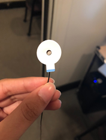
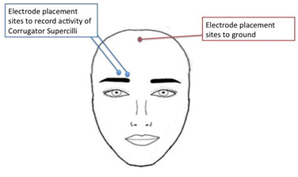
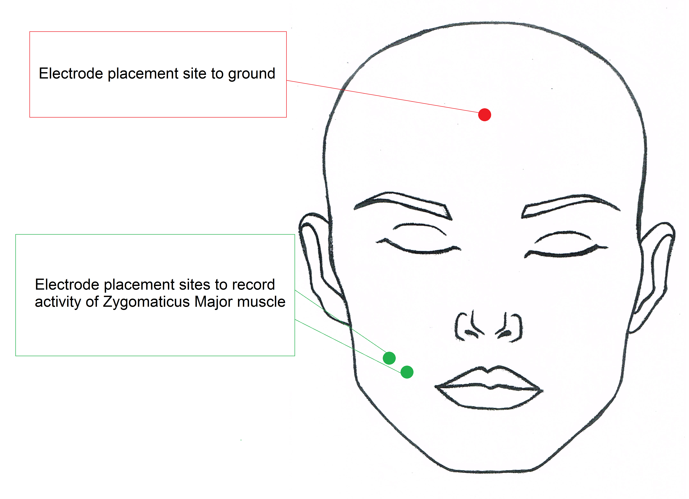
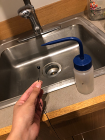

# Psychophysics - EMG {#psychophys-emg}

Written by Gregory Steward on Feb 12, 2020.

Ported to bookdown by Nathan Muncy on Jul 28, 2022.

## Introduction

An electromyogram (EMG) is a psychophysiology measure for evaluating and recording the electrical activity produced by skeletal muscles. An electromyograph detects the electric potential generated by muscle cells when these cells are electrically or neurologically activated. The LaBar lab most frequently studies Corrugator Facial EMG and Zygomaticus Facial EMG , which focuses on the coruggator supercili group of muscles above the eye and the zygomaticus major muscle along the cheek, respectively$^1$.

## Supplies

1. 4 x EL254S reusable shielded electrodes
2. 1 x EL254 reusable un-shielded electrode
3. 5 x ADD204 Stickers
4. Biopac gel 100/ Signa Gel
5. Non moisturizing alcohol wipe
6. Nu-prep
7. Q-tips
8. Tissues
9. Cotton swab/ cotton round

## Computer Preparation

1. Log into psychophysiology computer.
2. Check that the BIOPAC EMG module is set to the following:
    + 5000 gain
    + 500 Hz low pass filter
    + 100 Hz high pass filter turned off
    + 10 Hz high pass filter
3. Turn on BIOPAC system.
4. Open Acknowledge (5.0 for MP160 system, 4.1 for MP150 system).
5. Load experimental file template.
    + Check that the sampling rate is 1000 kHz.
    + Check that the input is Channel 2 (for EMG1) or 3 (for EMG2).
    + Check where the data is being saved.

## Face Preparation

1. Clean face with an alcohol wipe.

```{r img-61, fig.align='center', out.width='40%', echo=F}
knitr::include_graphics("imgs/06-EMG_supplies.jpg")
```

2. **OPTIONAL** - electrode face preparation can proceed just with the alcohol wipe) Apply the NuPrep (shown in the image above) with a Q-tip to the areas where the electrodes will be applied (see figure below for clarification on electrode placement sites). Apply mild pressure to scrub these areas with the Q-tip. Skin should be slightly red. This step helps to ensure that we are able to remove dead skin cells and have better conductance. If using NuPrep, make sure swabbed area is dry before applying electrodes.
3. Clean the NuPrep off with a cotton round or tissue.
4. Throw away all cotton pads, tissues, and Q-tips used during face prep.

## Electrode Preparation

1. Obtain 2 clean shielded EMG electrodes and 1 un-shielded EMG electrodes. The need for an un-shielded electrode is to establish a ground to help reduce noise. If you have a grounded lead already established with either ECG or EDA, you will not need to add this additional ground.

```{r img-62, fig.show='hold', fig.align='center', out.width='40%', out.height='10%', echo=F}
knitr::include_graphics(c("imgs/06-EMG_shielded.jpg","imgs/06-EMG_electrodes.png"))
```

2. Place the circle stickers on the lead so that the hole of the lead align, and so the tab of the sticker is the same direction of the wire as shown in the image below.

```{r img-63, fig.align='center', out.width='40%', echo=F}

```

3. *(Optional for Corrugator)* Cut off the top edge and the left edge of the sticker that hang over the edge of the lead for the shielded leads.

```{r img-64, fig.align='center', out.width='40%', echo=F}
knitr::include_graphics("imgs/06-EMG_adhesivediscs2.png")
```

4. Place signa gel into electrode well. Using a gel filled syringe, gently fill the well without touching the needle tip to the inside of the electrode. Make sure to fill it to the top of the well, but not too excessively. To get rid of any remaining air bubbles, use the packaging from the alcohol wipe or other rolled scrap of paper to stir the gel.

```{r img-65, fig.show='hold', fig.align='center', out.width='30%', out.height='10%', echo=F}
knitr::include_graphics(c("imgs/06-EMG_electrode_filling.jpg","imgs/06-EMG_electrode_filled2.jpg"))
```

## Electrode Placement - corrugator muscle

1. Place first electrode so that it is in line with the inner corner of the subject’s right eye and just above the subject’s eyebrow. The electrode should be placed so that the wire sits perpendicular to the subject’s eyebrow.
2. Place the second electrode to the left of the first electrode (to the subject’s right). The electrode should be placed so that the wire sits parallel to the subject’s eyebrow.

```{r img-66, fig.align='center', out.width='60%', echo=F}

```

3. If needed place the third un-shielded electrode in the middle of the forehead close to the hairline.
4. Place the lead wires behind the subject’s right ear and tape them to their right shoulder while the subject looks to their left. This will allow the subject to move or turn without tugging the wires.
5. For the shielded electrodes, plug the black wire (with the green shield marker) into the EMG plugs that say "shield". Plug the white signal wires into the the ports that say "VIN+" or "VIN-". Lastly, if you need a ground electrode, plug it into the center hole labelled "GND."

```{r img-67, fig.align='center', out.width='60%', echo=F}
knitr::include_graphics("imgs/06-EMG_electrode_wiring.jpg")
```

## Electrode Placement - zygomaticus muscle

1. Have the subject smile to see if you can see the general area of the zygomaticus muscle.
2. Place first shielded electrode so that is directly on the muscle, which should be about halfway from the middle of the subject's ear to the corner of the subject's mouth.

```{r img-68, fig.align='center', out.width='60%', echo=F}

```

3. Place the second shielded electrode adjacent to the first in the direction closer to the corner of the subject's mouth.
4. If needed place the third un-shielded electrode in the middle of the forehead close to the hairline and tuck the electrode lead wire behind the subject's ear.
5. Tape the electrodes to their right shoulder while the subject looks to their left. This will allow the subject to move or turn without tugging the wires.
6. For the shielded electrodes, plug the black wire (with the green shield marker) into the EMG plugs that say "shield". Plug the white signal wires into the the ports that say "VIN+" or "VIN-". Lastly, if you need a ground electrode, plug it into the center hole labelled "GND."

```{r img-69, fig.align='center', out.width='60%', echo=F}
knitr::include_graphics("imgs/06-EMG_electrode_wiring2.jpg")
```

## Cleaning

1. When finished with the experiment, remove the stickers from the electrodes and dispose of them.
2. Use the distilled water squeeze bottle by the sink to clean the gel completely out of the leads.

```{r img-610, fig.align='center', out.width='40%', echo=F}

```

3. If necessary, soak the electrode heads in a small cup of distilled water for 15 minutes and up to 1 hour and re-rinse with the squeeze bottle.
4. Hang the leads on the rack opposite of the sink to dry completely before using again.
5. Return all the gels, NuPrep, and stickers to their original locations.

```{r img-611, fig.align='center', out.width='60%', echo=F}
knitr::include_graphics("imgs/06-EMG_electrode_rack.jpg")
```

## References

1. Electromyography. (2022, Jul 27). In *Wikipedia*. [https://en.wikipedia.org/wiki/Electromyography](https://en.wikipedia.org/wiki/Electromyography)