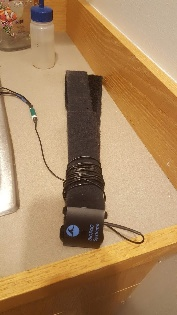
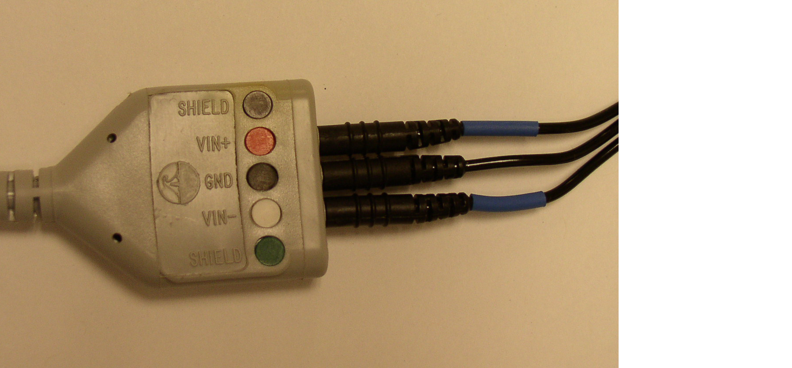

# Psychophysics - RSP {#psychophys-rsp}

Written by Gregory Steward on Sep 04, 2020.

Ported to bookdown by Nathan Muncy on Jul 29, 2022.

## Introduction

The Respiratory Effort Transducer measures changes in thoracic or abdominal circumference to assess respiratory effort.

## Supplies

Respiratory transducer belt. 

```{r img-71, fig.align='center', out.width='30%', echo=F}

```

1. Loosen one or both ends of the velcro on the transducer and wrap it around the chest of the subject (or have the subject wrap it around themselves if it is more comfortable).
2. Tighten the Respiratory Effort Transducer around the most expanded area of the subject’s abdomen during breathing (generally about 5 cm below the armpits), and tighten one or both straps until it fits snugly but is not uncomfortable.  The sensor should be placed on the front of the chest. 
3. Plug the transducer cable into the MEC100C extension cable labelled RSP. 

```{r img-72, fig.align='center', out.width='60%', echo=F}

```

If you have trouble getting a signal from the belt, try using one of the back up belts in the drawers of the testing room. 
