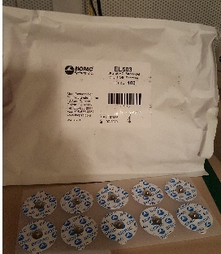

# Psychophysics - STIM {#psychophys-stim}

Written by Gregory Steward on Sep 16, 2019.

Ported to bookdown by Nathan Muncy on Jul 29, 2022.

## Supplies

1. 2 x EL203 disposable electrodes
2. 2 x LEAD110
3. Paper Towel
4. Gel 100

## Computer Preparation

1. Log into psychophysiology computer.
2. Turn on BIOPAC system.
3. Turn on the stim box (**Note**: the stim box sends out a pulse on initializing, so make sure that the subject is not connected).
4. Make sure the stimulation level is set at 0.
5. Open Acknowledge (5.0 for MP160 system, 4.1 for MP150 system).
6. Load experimental file template.
    + Check that the input is Channel 4 (analog).
    + **Check where the data is being saved.**
7. (*Optional*) Open Presentation for the stim work-up, ignore if calibrating manually.

## Electrode Preparation and Placement
1. Have the subject wash their hands/wrists with non-moisturizing and dye-free soap then dry with a paper towel (if there is no soap following the specifications, have the participant rinse with just water).
2. While subject is drying, apply a "pea sized" drop of Gel 100 to the underside of one of the disposable electrodes.

```{r img-81, fig.align='center', out.width='40%', echo=F}
knitr::include_graphics("imgs/03-ECG_gel.jpg")
```

```{r img-82, fig.align='center', out.width='40%', echo=F}

```

3. Apply the gelled electrodes the left forearm in close proximity, but not overlapping. 

```{r img-83, fig.align='center', out.width='30%', echo=F}
knitr::include_graphics("imgs/08-Stim_wrist.png")
```

4. Take the two leads attached to the stim cable and connect to the recently placed electrodes.

## Stim Calibration

Because the tolerance for electrical stimulation can vary wildly by individual subject, we calibrate the voltage level of stimulation each subject receives in a process called "stim work-up."

There are two means of doing the stim work-up; digital and analog. The primary difference is the duration of the stimulation, where you can set the digital to any time length (6 ms usually), whereas the analog is at a fixed 15ms.  

### Digital calibration

1. Open the stim work-up file for the Presentation software (make sure the stim box voltage level is set to 0, or that the subject is disconnected from the electrode leads).
2. Set the voltage level to 10 volts on the stim box.
3. Tell the subject that we are going to tailor their level of stimulation to a point that they find annoying, but not painful and that you will start with a low level starter pulse.
4. Trigger the presentation software to send a pulse (it should be using port code 21).
5. Ask the subject how they feel.
6. Increase the voltage by 10 if the subject feels the level is weak.
7. Repeat steps 4-6 until the subject starts to feel something stronger.
8. Fine tune by increments of 2-5 volts until you find the level where the subject says the stimulation is annoying but not painful. 

### Analog calibration

1. Set the voltage level to 10 volts on the stim box.
2. Tell the subject that we are going to tailor their level of stimulation to a point that they find annoying, but not painful and that you will start with a low level starter pulse.
3. Press the manual pulse button on the back of the stim box.
4. Ask the subject how they feel.
5. Increase the voltage by 10 if the subject feels the level is weak.
6. Repeat steps 4-6 until the subject starts to feel something stronger.
7. Fine tune by increments of 2-5 volts until you find the level where the subject says the stimulation is annoying but not painful.

## Clean Up

1. Set the stim box voltage to 0 volts.
2. Turn off the stim box (if the stim box is left on overnight it will likely blow a fuse).
3. Remove the leads from the subject and hang them back up on the stim hook.
4. Instruct the subject to remove the electrodes from their arm and dispose of them.
5. Offer the subjects a wet paper towel or show them the sink to clean excess gel left on their arm.
